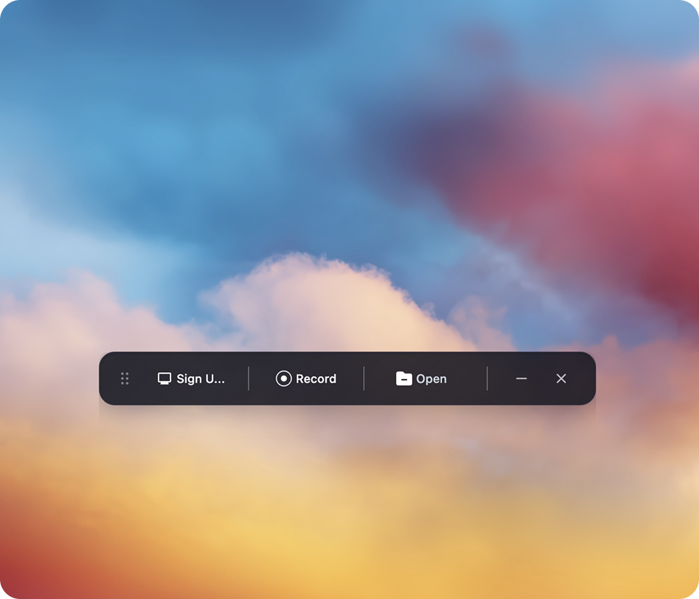
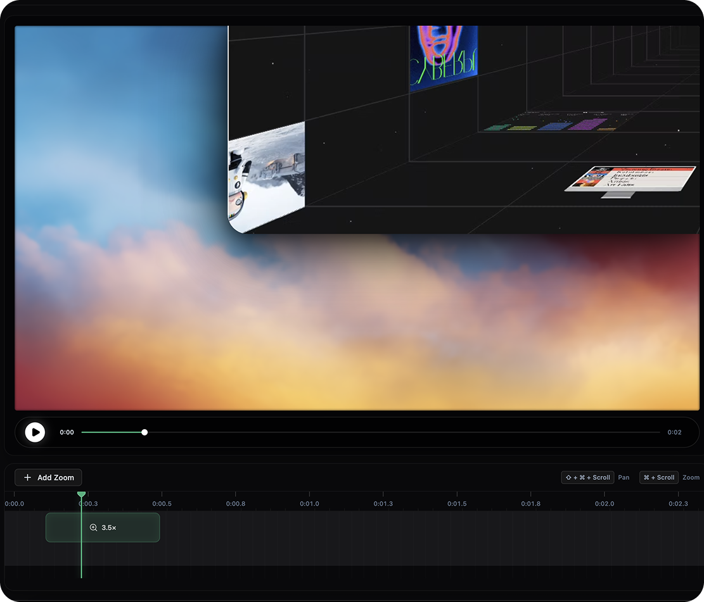

> [!WARNING]
> This is very much in beta and might be buggy here and there (but hope you have a good experience!).

<p align="center">
  
  <br />
  <br />
  <a href="https://discord.gg/yAQQhRaEeg">
    
  </a>
</p>

# <p align="center">Auto Screen</p>

<p align="center"><strong>Auto Screen is your free, open-source alternative to Screen Studio (sort of).</strong></p>

If you don't want to pay $29/month for Screen Studio but want a much simpler version that does what most people seem to need, making beautiful product demos and walkthroughs, here's a free-to-use app for you. Auto Screen does not offer all Screen Studio features, but covers the basics well!

Screen Studio is an awesome product and this is definitely not a 1:1 clone. Auto Screen is a much simpler take, just the basics for folks who want control and don't want to pay. If you need all the fancy features, your best bet is to support Screen Studio (they really do a great job, haha). But if you just want something free (no gotchas) and open, this project does the job!

Auto Screen is 100% free for personal and commercial use. Use it, modify it, distribute it. (Just be cool 😁 and give a shoutout if you feel like it !)

<p align="center">
	
	
</p>

## Core Features
- Record specific windows or your whole screen.
- Add automatic or manual zooms (adjustable depth levels) and customize their durarion and position.
- Record microphone and system audio.
- Crop video recordings to hide parts.
- Choose between wallpapers, solid colors, gradients or a custom background.
- Motion blur for smoother pan and zoom effects.
- Add annotations (text, arrows, images).
- Trim sections of the clip.
- Customize the speed of different segments.
- Export in different aspect ratios and resolutions.

## Installation

Download the latest installer for your platform from the official Auto Screen release channel.

### Release artifacts

Auto Screen now builds separate artifacts per operating system.

| OS | Recommended download | Notes |
| --- | --- | --- |
| macOS Apple Silicon | `Auto Screen-<version>-mac-arm64.dmg` | Primary installer for M1/M2/M3 Macs |
| macOS Intel | `Auto Screen-<version>-mac-x64.dmg` | Installer for Intel Macs |
| Windows 64-bit | `Auto Screen-<version>-win-x64.exe` | NSIS installer |
| Linux AppImage | `Auto Screen-<version>-linux-x64.AppImage` | Best for direct download distribution |
| Linux Debian/Ubuntu | `Auto Screen-<version>-linux-x64.deb` | Recommended for Debian-based systems |

Generated files are written to:

```bash
release/<version>/
```

To print the exact files created after a build:

```bash
npm run release:artifacts
```

To remove unpacked folders, old installer names, and keep only release-ready files:

```bash
npm run release:clean
```

### Build commands by OS

```bash
# macOS universal release targets
npm run build:mac

# macOS per architecture
npm run build:mac:arm64
npm run build:mac:x64

# Windows
npm run build:win
npm run build:win:x64

# Linux
npm run build:linux
npm run build:linux:x64
```

### Recommended release hosts

| Target | Recommended build host | Status |
| --- | --- | --- |
| macOS `.dmg` | macOS | Verified |
| Windows `.exe` | Windows | Config prepared |
| Linux `.AppImage` / `.deb` | macOS or Linux | Verified on macOS |

For final commercial release, build each platform on its native OS when possible, then run `npm run release:clean` before upload.

### GitHub release automation

The repo now supports a two-lane release workflow in GitHub Actions:

- `workflow_dispatch`: builds macOS, Windows, and Linux packages and uploads the release-ready artifacts to the workflow run.
- `push` tags matching `v*`: builds the same packages and publishes the installers plus updater metadata to GitHub Releases.

Tag builds should match `package.json` versioning. Example: version `1.3.0` should be released with tag `v1.3.0`.

Expected release assets now include:

- macOS: `.dmg`, `.zip`, `.blockmap`, `latest-mac.yml`
- Windows: `.exe`, `latest.yml`
- Linux: `.AppImage`, `.deb`, `latest-linux.yml`

### macOS

If macOS Gatekeeper blocks the app before signing/notarization is fully configured, you can temporarily bypass quarantine after install:

```bash
xattr -rd com.apple.quarantine /Applications/Auto\ Screen.app
```

Give your terminal Full Disk Access in **System Settings > Privacy & Security** if needed, then run the command above.

After that, open **System Settings > Privacy & Security** and allow the required permissions for screen recording, microphone, camera, and accessibility.

### Windows

Use the `.exe` installer for most users.

- `Auto Screen-<version>-win-x64.exe`

If Windows SmartScreen warns before code signing is configured, choose **More info** → **Run anyway** only for internal testing builds.

### Linux

For AppImage:

```bash
chmod +x Auto\ Screen-<version>-linux-x64.AppImage
./Auto\ Screen-<version>-linux-x64.AppImage
```

For Debian/Ubuntu:

```bash
sudo apt install ./Auto\ Screen-<version>-linux-x64.deb
```

You may need to grant screen recording permissions depending on your desktop environment.

If the AppImage fails with a sandbox error, run:

```bash
./Auto\ Screen-<version>-linux-x64.AppImage --no-sandbox
```

### Limitations

System audio capture relies on Electron's [desktopCapturer](https://www.electronjs.org/docs/latest/api/desktop-capturer) and has some platform-specific quirks:

- **macOS**: Requires macOS 13+. On macOS 14.2+ you'll be prompted to grant audio capture permission. macOS 12 and below does not support system audio (mic still works).
- **Windows**: Works out of the box.
- **Linux**: Needs PipeWire (default on Ubuntu 22.04+, Fedora 34+). Older PulseAudio-only setups may not support system audio (mic should still work).

## Built with
- Electron
- React
- TypeScript
- Vite
- PixiJS
- dnd-timeline

## Local MCP workflow
If you are wiring Auto Screen to CLI agents such as Codex CLI or Claude Code, see [docs/local-mcp-workflow.md](docs/local-mcp-workflow.md).

---

_I'm new to open source, idk what I'm doing lol. If something is wrong please raise an issue 🙏_

## Contributing

Contributions are welcome! If you’d like to help out or see what’s currently being worked on, please use the official Auto Screen contribution channel and project board for the latest roadmap and contribution guidelines.

## License

This project is licensed under the [MIT License](./LICENSE). By using this software, you agree that the authors are not liable for any issues, damages, or claims arising from its use.
